# NP3 Lab

**니콘 Z 플렉시블 컬러 레시피(.NP3)를 SD카드에서 바로 관리하는 Mac·안드로이드 앱**입니다. 카드를 꽂으면 앱이 저절로 열리고, 카드 속 레시피를 보여주고, 원하는 레시피를 한 번에 넣고 뺍니다.

> ⚠️ **비공식 서드파티 도구입니다.** Nikon Corporation과 관련이 없고 Nikon의 보증이나 후원을 받지 않았습니다. Nikon, Nikon Z, Zf, Z8, Z9, Picture Control은 Nikon Corporation의 상표입니다. 자세한 내용은 [NOTICE.md](NOTICE.md)를 보세요.

[English](#english) · [日本語](#日本語) · [안드로이드판](#안드로이드판) · [다운로드 (Releases)](https://github.com/MJ-best/np3-lab/releases) · [출처와 라이선스](NOTICE.md)

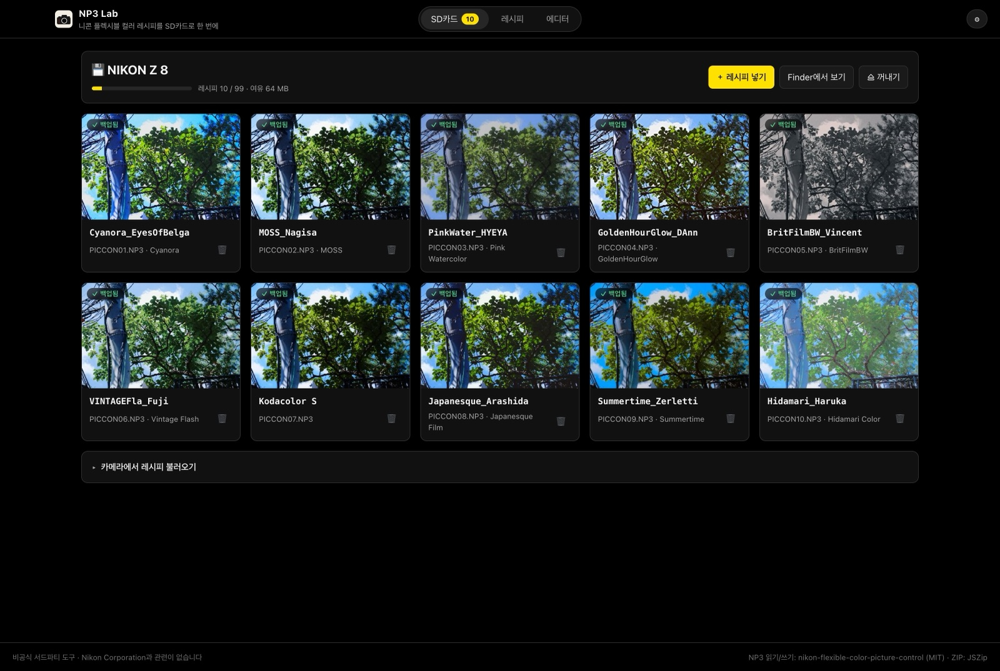

---

## 왜 만들었나

- **9개 슬롯의 벽:** Nikon Imaging Cloud는 레시피를 9개까지만 카메라로 보낼 수 있습니다. 새 레시피를 쓰려면 커스텀 슬롯으로 복사하고, 클라우드를 비우고, 다시 고르고, 다시 동기화하는 과정을 반복해야 합니다.
- **클라우드를 못 쓰는 기종:** Z8·Z9는 펌웨어 업데이트로 플렉시블 컬러를 지원하지만 Imaging Cloud는 쓸 수 없습니다. 레시피를 넣는 방법은 메모리 카드뿐입니다.
- **폴더를 직접 만들어야 하는 번거로움:** 카드에 `NIKON/CUSTOMPC` 폴더를 만들고 파일을 복사하는 일을 매번 손으로 해야 했습니다.

NP3 Lab을 쓰면 이렇게 됩니다. **카드 꽂기 → 레시피 넣기 → 꺼내기 → 카메라에서 불러오기**

## 주요 기능

| | |
| --- | --- |
| **카드 자동 인식** | 카드를 꽂으면 메뉴 막대에서 기다리던 앱이 열리고 `NIKON/CUSTOMPC` 속 레시피를 미리보기와 함께 보여줍니다. 다른 브랜드 카드와 네트워크 드라이브는 무시합니다. |
| **넣기·빼기·이름 바꾸기** | **＋ 레시피 넣기**로 여러 개를 한 번에 넣습니다. 번호(`PICCON01.NP3`…)는 자동으로 매기고 겹치지 않게 합니다. 카메라에 보일 이름을 바꿀 수 있고, 빼기는 휴지통으로 옮겨서 **되돌리기**가 됩니다. |
| **나만의 필터 라이브러리** | 레시피마다 그 레시피로 찍은 내 사진을 모아 갤러리로 봅니다. 니콘 사진(JPEG·RAW NEF)을 어디서 추가하든(창에 끌어다 놓기, 가져오기 › 사진, 레시피의 사진 추가) 사진 정보에 기록된 Picture Control 이름으로 레시피를 찾아 **자동으로 정리**합니다. 레시피 정보가 없는 사진만 보고 있던 레시피에 들어갑니다. 맨 위 **갤러리** 탭에서 모든 사진을 레시피별로 모아 보고, 레시피 탭과 같은 검색창으로 찾습니다. |
| **프레임** | 사진에 레시피 이름과 촬영 정보(카메라·렌즈·초점거리·조리개·셔터·ISO·날짜)를 담아 저장합니다. 스트랩·브랜드·Shot on·폴라로이드·필름·시네마 등 레이아웃 14가지, 배경 3가지, 1:1·4:5·9:16 비율을 고르고, 사진 앱처럼 손가락으로 자르고 돌린 뒤(격자 표시) 저장합니다. 휴대폰에서는 공유 창으로 바로 사진 앱에 넣습니다. |
| **자동 백업** | 카드에서 처음 보는 레시피는 내 레시피에 자동으로 보관합니다. 카드를 포맷해도 레시피가 남습니다. |
| **커뮤니티 레시피 260여 개** | Nikon 크리에이터 · Nikon 컬러 그레이딩 · 독립 크리에이터 · SerbanJPG 필름 레시피를 원본 저장소에서 바로 받습니다. 업데이트할 때는 바뀐 파일만 받습니다. 레시피마다 크리에이터·원본 링크와 함께 **설명·컨셉·추천 장면**이 표시되고 검색됩니다. |
| **미리보기 비교** | 풍경·피부톤·야경·컬러 차트나 내 사진 위에서 원본/적용을 슬라이더로 비교합니다. 레시피 수치로 계산한 근사치입니다. |
| **플렉시블 에디터** | 샤프닝, 명료도, 톤, 채도, 컬러 블렌더 8색, 컬러 그레이딩 3구간, 톤 커브(최대 20점)를 조절해 나만의 `.NP3`를 만듭니다. |
| **원하는 느낌** | 에디터에서 버튼 한 번으로 분위기(맑고 투명하게·감성 필름·포지티브 필름·빈티지·시네마틱·몽환적인·진한 흑백), 피부톤(웜톤·쿨톤·핑크톤·뽀얀 피부·생기 있게), 색 강조를 더합니다. 줄마다 하나씩 섞고 강도를 고르며, 다시 누르면 빠집니다. 값은 커뮤니티 레시피 265개가 각 느낌에 실제로 쓰는 설정과 비교해 맞췄습니다. |
| **NX Studio에서 바로 가져오기** | NX Studio 등에서 NP3를 파일로 내보내면 어느 폴더에 저장했든 Spotlight로 찾아냅니다. 앱을 앞으로 가져오면 "새 NP3 n개 발견 · 가져오기" 알림이 뜨고, 가져오기 메뉴의 **이 Mac에서 NP3 찾기**로 최신 파일부터 볼 수도 있습니다. |
| **전체 레시피 내보내기** | 레시피 탭 맨 아래 **전체 레시피 내보내기 (NP3)**로 모든 레시피를 고른 폴더에 `My Recipes/`, `Community/<모음>/` 구조로 저장합니다. 기존 파일은 덮어쓰지 않습니다. 같은 이름에 내용이 다르면 `이름_20261001.NP3`처럼 날짜를 붙여 저장하고, 내용이 같으면 건너뜁니다. |
| **Reddit·텍스트 가져오기** | 커뮤니티에 글로 공유된 수치를 붙여넣으면 레시피 여러 개를 자동으로 나눠 가져옵니다(한국어·영어). |
| **기종별 불러오기 안내** | 카드를 뽑으면 Zf·Z6III·Z5II·Z50II·ZR·Z8·Z9별 메뉴 경로와 필요한 펌웨어를 보여줍니다. |

| 레시피 갤러리 | 원본/적용 비교 | 기종별 안내 |
| --- | --- | --- |
| 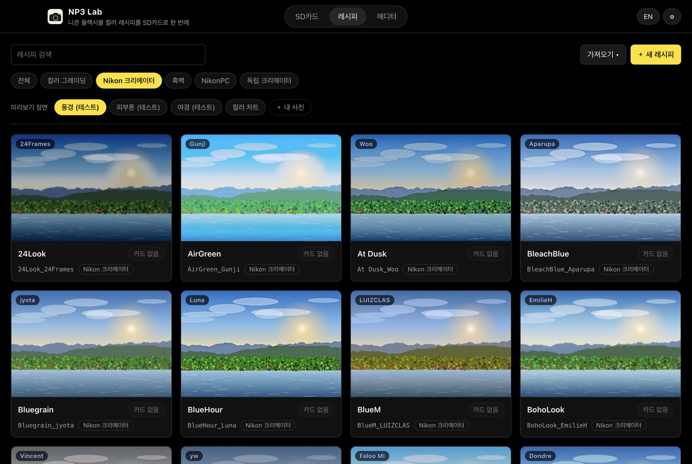 | 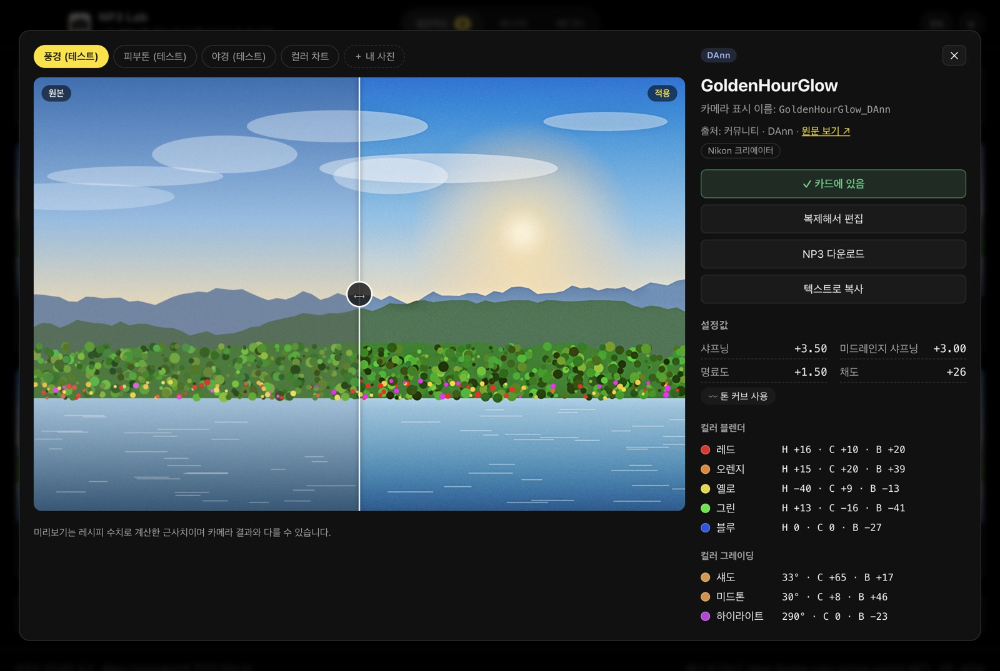 | 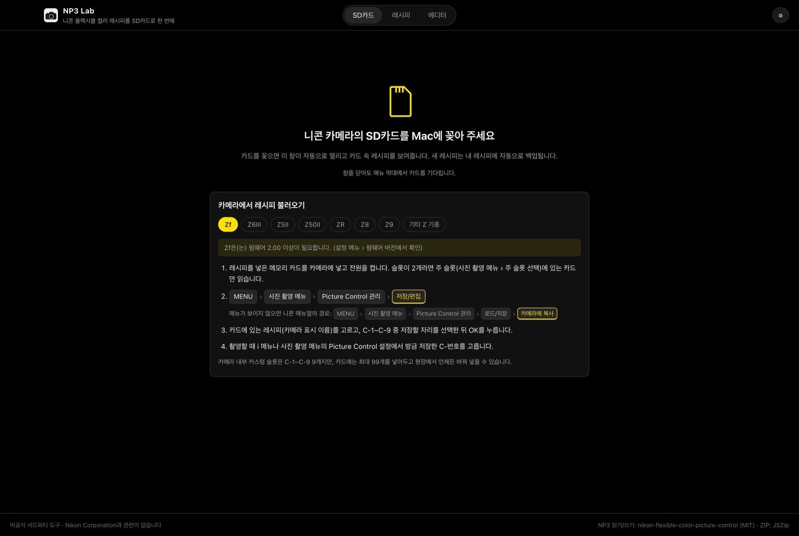 |

## 설치 (Mac)

1. [Releases](https://github.com/MJ-best/np3-lab/releases)에서 `NP3-Lab-x.y.z-arm64.dmg`를 받아 엽니다. Apple Silicon Mac, macOS 12 이상이 필요합니다.
2. **NP3 Lab**을 **응용 프로그램** 폴더로 끌어다 놓습니다.
3. 개인 프로젝트라 Apple 서명·공증을 받지 않았습니다. 그래서 공식 릴리스에서 받은 파일이 맞는지 직접 확인하는 것을 권합니다. 릴리스의 `SHA256SUMS.txt`도 함께 받아 같은 폴더에서 `shasum -a 256 -c SHA256SUMS.txt --ignore-missing`을 실행하면 `OK`가 나와야 합니다. 자세한 내용은 [SECURITY.md](SECURITY.md)를 보세요.
4. 처음 열 때 경고가 나오면 앱을 **우클릭 → 열기**를 누르거나, **시스템 설정 → 개인정보 보호 및 보안 → 그래도 열기**를 누르세요.
   - "손상되었기 때문에 열 수 없습니다"라고 나오면 터미널에서 아래 명령을 한 번 실행하세요.

```bash
xattr -cr "/Applications/NP3 Lab.app"
```

## 사용법

1. 앱을 열고 **레시피** 탭에서 **커뮤니티 레시피 받기**를 누릅니다. 처음 한 번만 하면 됩니다.
2. 카메라의 SD카드를 Mac에 꽂습니다. 앱이 열리고 카드 속 레시피가 나옵니다.
3. **＋ 레시피 넣기**로 원하는 레시피를 고르면 바로 카드에 저장됩니다.
4. **⏏ 꺼내기**를 누른 뒤 카드를 카메라에 넣고, 카메라에서 C-1~C-9 슬롯에 불러옵니다.
   - **Zf:** MENU → 사진 촬영 메뉴 → Picture Control 관리 → 저장/편집
   - **Z6III · Z5II · Z50II · ZR · Z8 · Z9:** MENU → 사진 촬영 메뉴 → Picture Control 관리 → 로드/저장 → 카메라에 복사
   - Zf는 FW 2.00 이상, Z8은 FW 3.00 이상, Z9는 FW 5.30 이상이 필요합니다. 다른 Z 기종은 플렉시블 컬러를 지원하지 않습니다.

- 창을 닫아도 앱은 **메뉴 막대**에서 카드를 기다리고, 로그인할 때 자동으로 실행됩니다. 이 동작은 **⚙︎ 설정**에서 끌 수 있습니다.
- 카메라 안의 슬롯은 여전히 C-1~C-9 9개입니다. 대신 카드에는 최대 99개를 넣어 두고 현장에서 언제든 바꿔 넣을 수 있습니다.

## 저작권과 레시피 출처

- 커뮤니티 레시피의 출처는 [shouryan01/Nikon-Recipes](https://github.com/shouryan01/Nikon-Recipes)와 [SerbanJPG](https://serbanjpg.com)([vanlong20it/recipe-note](https://github.com/vanlong20it/recipe-note) 경유)이고, 레시피 설명은 [Timor88/NikonNP3](https://github.com/Timor88/NikonNP3)를 참고했습니다. 자세한 내용은 [NOTICE.md](NOTICE.md)를 보세요. 레시피의 저작권은 **Nikon과 각 크리에이터**에게 있습니다.
- 원본 저장소에는 라이선스가 없어서, NP3 Lab은 레시피 파일을 **이 저장소와 배포 파일에 넣지 않습니다.** 사용자가 앱에서 버튼을 누르면 원본 저장소에서 직접 받아 자신의 컴퓨터에만 저장합니다.
- 받은 레시피는 개인 용도로 쓰고, 공유할 때는 크리에이터를 밝혀 주세요.
- 크리에이터나 저장소 관리자께서 제외를 원하시면 [이슈](https://github.com/MJ-best/np3-lab/issues)를 남겨 주세요.

## 알아둘 점

- **미리보기는 근사치입니다.** 니콘의 실제 처리 엔진이 아니라 레시피 수치로 계산한 결과입니다.
- **실기 검증:** Nikon Zf(펌웨어 3.01)에서 이 앱으로 카드에 넣은 NP3를 사진 촬영 메뉴 › Picture Control 관리 › 저장/편집으로 등록할 수 있음을 확인했습니다. Zf로 찍은 JPEG와 RAW(NEF)를 끌어다 놓으면 사진 정보(EXIF)로 촬영에 쓴 레시피를 찾아 정리하는 기능도 실제 파일로 확인했습니다. 다른 기종에서 확인하셨다면 이슈로 알려 주세요.
- NP3 쓰기는 커뮤니티가 역공학한 라이브러리를 사용합니다. 직접 만든 레시피는 중요한 촬영 전에 카메라에서 먼저 확인하세요. 카드에서 읽거나 커뮤니티에서 받은 파일은 원본 바이트 그대로 씁니다.
- NP3 형식상 톤 커브를 쓰면 콘트라스트·하이라이트·섀도·화이트/블랙 레벨은 저장되지 않습니다.

## 브라우저판

설치 없이 [Releases](https://github.com/MJ-best/np3-lab/releases)의 `NP3-Lab.html`을 Chrome이나 Edge로 열어도 대부분의 기능을 쓸 수 있습니다. Windows에서도 됩니다. 카드 자동 인식은 안 되고, 레시피를 담아 **SD카드에 바로 저장**(폴더 선택)하거나 **ZIP**으로 받습니다.

## 안드로이드판

Android 7.0 이상 휴대폰·태블릿에서 Mac 앱과 같은 카드 중심 화면을 씁니다. 아직 실험 단계입니다. 준비물은 **USB OTG 카드리더**(휴대폰 단자에 맞는 USB-C SD카드 리더)입니다.

### 1. 카드 연결 (처음 한 번)

<table>
<tr>
<td valign="top">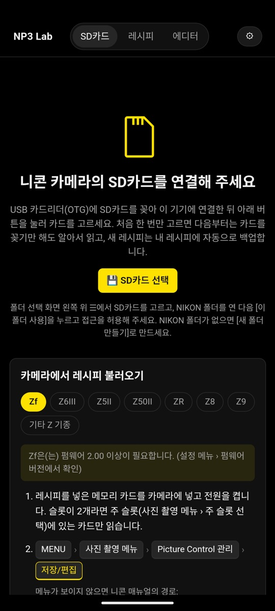<br><sub>① 카드리더에 SD카드를 꽂아 연결하고 <b>SD카드 선택</b>을 누릅니다.</sub></td>
<td valign="top">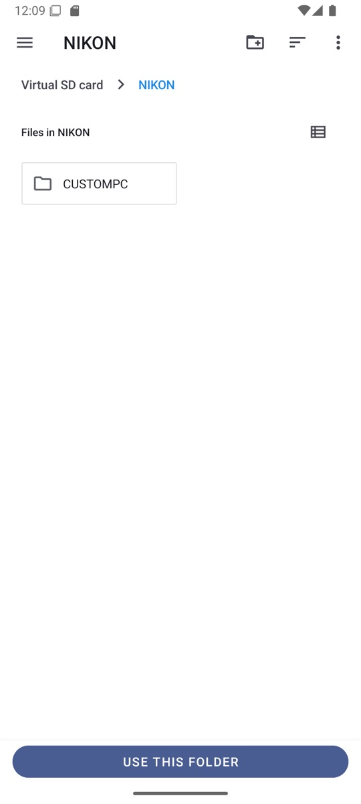<br><sub>② 왼쪽 위 ☰에서 SD카드를 고르고 <b>NIKON</b> 폴더를 연 다음 <b>이 폴더 사용</b> → <b>허용</b>.</sub></td>
<td valign="top">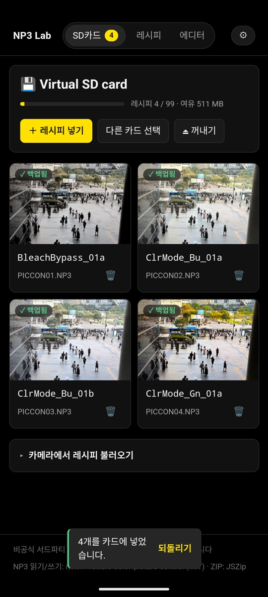<br><sub>③ 카드 속 레시피가 보입니다. 다음부터는 카드를 꽂기만 하면 저절로 읽습니다.</sub></td>
</tr>
</table>

> 안드로이드는 SD카드의 맨 위 폴더를 고를 수 없게 막아 두었습니다. 그래서 `NIKON` 폴더를 고릅니다. 폴더가 없으면 폴더 선택 화면에서 **새 폴더 만들기**로 `NIKON`을 만드세요.

### 2. 레시피 넣기 · 고르기 · 만들기

<table>
<tr>
<td valign="top">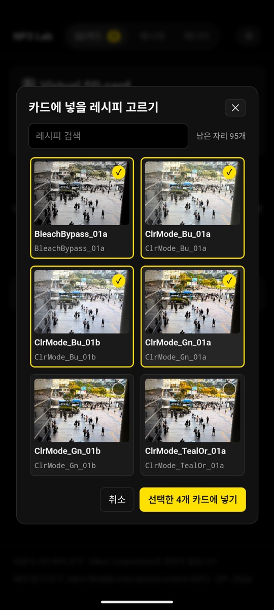<br><sub><b>＋ 레시피 넣기</b>로 여러 개를 골라 한 번에 넣습니다. 파일 이름(PICCON01.NP3…)은 자동으로 매깁니다.</sub></td>
<td valign="top">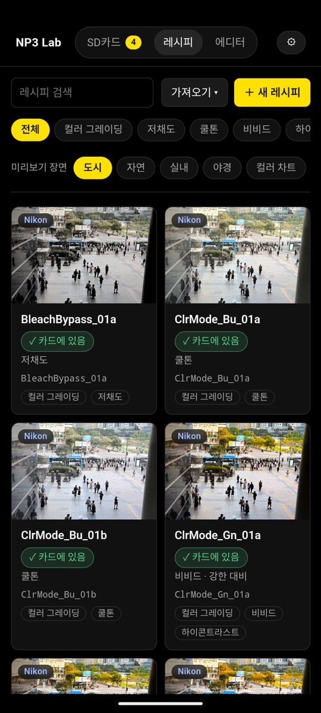<br><sub><b>레시피</b> 탭: 커뮤니티 레시피 260여 개를 받아 검색·필터로 찾습니다.</sub></td>
<td valign="top">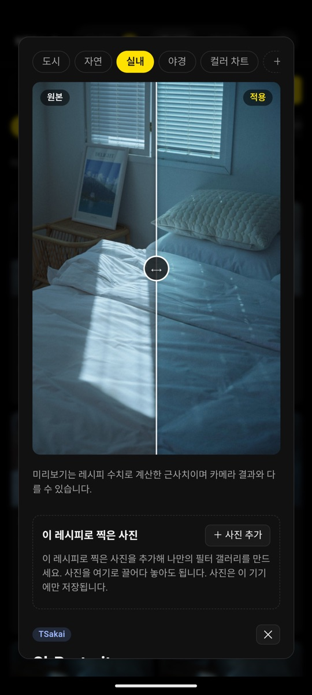<br><sub>레시피를 누르면 원본/적용을 슬라이더로 비교합니다. 장면을 바꾸거나 내 사진으로도 볼 수 있습니다.</sub></td>
</tr>
</table>
<table>
<tr>
<td valign="top">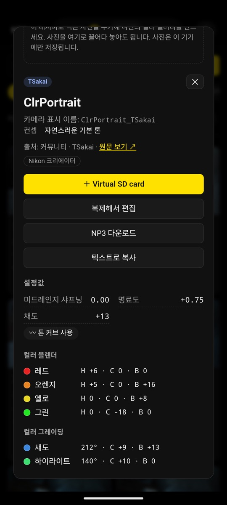<br><sub>카드에 넣기, 복제해서 편집, NP3 저장, 텍스트 복사와 전체 설정값.</sub></td>
<td valign="top">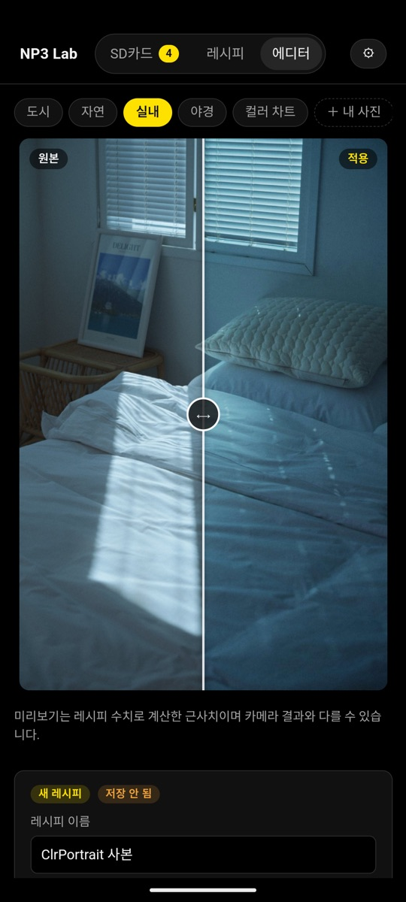<br><sub><b>에디터</b> 탭에서 나만의 레시피를 만듭니다.</sub></td>
<td valign="top">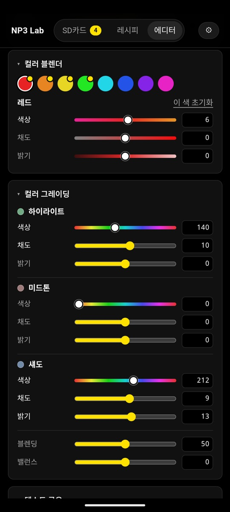<br><sub>컬러 블렌더 8색, 컬러 그레이딩 3구간, 톤 커브까지 조절합니다.</sub></td>
</tr>
</table>

### 3. 카메라에서 불러오기

<table>
<tr>
<td valign="top">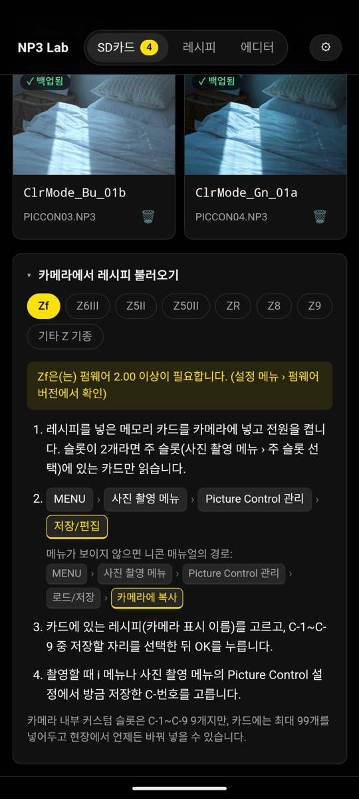<br><sub>카드 화면 아래 <b>카메라에서 레시피 불러오기</b>에 기종별 메뉴 경로가 나옵니다.</sub></td>
</tr>
</table>

꺼낼 때는 알림창의 USB 저장소 알림에서 **꺼내기**를 누른 뒤 카드리더를 뽑으세요.

### Mac 앱과 다른 점

- 레시피 빼기는 휴지통이 없어 바로 지워집니다. 대신 바로 뜨는 **되돌리기**로 다시 넣을 수 있습니다.
- NP3·백업 저장은 시스템 저장 창으로, 전체 내보내기는 고른 폴더로 저장합니다.
- 카드 자동 실행, 로그인 시 실행, NX Studio 파일 찾기는 없습니다.

## 개발

Node.js 22 이상이 필요합니다.

```bash
npm install
```

```bash
npm run app:dev    # Mac 앱 개발 모드 (화면 수정이 바로 반영)
```

```bash
npm test           # 단위 테스트
```

```bash
npm run dist:mac   # release/에 설치용 DMG 생성
```

```bash
npm run build      # dist/NP3-Lab.html 브라우저판
```

```bash
npm run apk        # android/app/build/outputs/apk/debug/app-debug.apk (JDK 21, Android SDK 36 필요)
```

- 직접 만든 레시피를 기본으로 넣으려면 `recipes/`에 JSON이나 `.NP3`를 두세요. 형식은 [recipes/README.md](recipes/README.md)를 보세요.
- 미리보기 사진을 바꾸려면 `samples/`에 사진을 넣으세요. [samples/README.md](samples/README.md)를 보세요.
- 아이폰·아이패드판은 개발 중입니다. `npm run build:ios`로 웹을 빌드해 `ios/App/App.xcodeproj`를 Xcode로 열고 기기에 설치합니다(Apple 개발자 계정 필요). 카드는 파일 앱 선택창으로 한 번 고르면 기억합니다.
- 구조: `electron/`(카드 감지·파일 작업·메뉴 막대), `android/`·`src/androidBridge.ts`(Android: 저장소 접근 프레임워크로 카드 폴더 읽기·쓰기), `ios/`(iPhone·iPad: `SafFoldersPlugin.swift`로 같은 카드 기능), `src/cards.ts`(카드 동기화·자동 백업), `src/community.ts`(커뮤니티 레시피 받기·증분 업데이트), `src/data/recipeNotes.ts`(레시피 설명), `src/look.ts`(수치로 컨셉 분석), `src/moods.ts`(원하는 느낌 버튼), `src/frame.ts`·`src/exif.ts`(프레임·촬영 정보), `src/np3/`(NP3 모델·톤 커브·텍스트 파서), `src/render/`(WebGL2 미리보기), `src/ui/`(화면).
- 버그 제보와 PR 환영합니다. Windows 지원(꺼내기, 안내 문구)은 도움이 필요한 부분입니다.

## 라이선스

코드는 [MIT](LICENSE)입니다. 사용한 오픈소스와 참고 자료, 상표 고지는 [NOTICE.md](NOTICE.md)에 정리했습니다.

---

## English

**NP3 Lab** is an unofficial Mac app for Nikon Z **Flexible Color Picture Controls (.NP3)**. It is not affiliated with Nikon Corporation.

- **Insert the SD card and it opens by itself.** You see the recipes in `NIKON/CUSTOMPC` with previews. You can add recipes (numbered `PICCON01.NP3`… automatically), rename them (the name shown on the camera), remove them to the Trash with Undo, and eject. The app waits in the menu bar and starts at login.
- **Automatic backup:** recipes found on a card are saved to My recipes.
- **Your own filter library:** keep the photos you shot with each recipe as its gallery. Nikon JPEGs and RAW (NEF) files are filed under the recipe named in their EXIF automatically, however you add them (drop on the window, Import → Photos, or Add photos on a recipe).
- **260+ community recipes:** Nikon creators, Nikon color grading presets, independent creators and [SerbanJPG](https://serbanjpg.com) film recipes, downloaded in the app from [shouryan01/Nikon-Recipes](https://github.com/shouryan01/Nikon-Recipes) and [vanlong20it/recipe-note](https://github.com/vanlong20it/recipe-note). Updates only fetch changed files. Each recipe shows its creator, a link to the original file, and a searchable description, concept and recommended use (notes based on [Timor88/NikonNP3](https://github.com/Timor88/NikonNP3)).
- **Straight from NX Studio:** export a Picture Control to an NP3 file anywhere and NP3 Lab finds it with Spotlight. Bring the app forward to get a "new NP3 found · Import" prompt, or use Import → Find NP3 files on this Mac (newest first).
- **Export all recipes** as NP3 files into a folder (`My Recipes/`, `Community/<collection>/`). Existing files are never overwritten: a different file with the same name gets the date appended (`Name_20261001.NP3`), and unchanged recipes are skipped.
- **Gallery tab:** every photo grouped by recipe, with the same search box as Recipes.
- **Frames:** save a photo with its recipe name and shooting details (camera, lens, focal length, aperture, shutter, ISO, date) in 14 layouts (strap, brand, Shot on, Polaroid, film, cinema…), three backgrounds and 1:1 / 4:5 / 9:16 canvases; crop and straighten it like in a phone photo editor first.
- **One-tap looks in the editor:** a mood (clear, soft film, positive film, vintage, cinematic, dreamy, rich B&W), a skin tone (warm, cool, pink, fair, healthy) and a colour to bring out, combined at the strength you choose. Their values are checked against what ~265 community recipes for each look actually use.
- **Editor, before/after preview, Reddit/text import, per-model camera instructions** (Zf, Z6III, Z5II, Z50II, ZR, Z8, Z9).

**Recipes and copyright.** The community recipes belong to Nikon and their creators, and the source repositories have no license. NP3 Lab does **not** include or redistribute any recipe files. Users download them from the original repository to their own computer. If you are a creator and prefer to be excluded, please [open an issue](https://github.com/MJ-best/np3-lab/issues).

**Android (experimental):** the same card-first app on Android 7.0+ phones and tablets, with a USB OTG card reader. Tap **Choose SD card**, pick the card's `NIKON` folder (Android doesn't allow choosing the card's top folder) and allow access; after that the card is read whenever it's plugged in. Screenshots: [안드로이드판](#안드로이드판).

**Install:** download the DMG from [Releases](https://github.com/MJ-best/np3-lab/releases) and drag the app to Applications. It isn't notarized, so first check the download against the release's `SHA256SUMS.txt` (`shasum -a 256 -c SHA256SUMS.txt --ignore-missing` should print `OK`), then right-click → Open the first time, or run `xattr -cr "/Applications/NP3 Lab.app"`. See [SECURITY.md](SECURITY.md).

**Loading on the camera:**
- **Zf:** MENU → Photo shooting menu → Manage Picture Control → Save/edit
- **Z6III, Z5II, Z50II, ZR, Z8, Z9:** MENU → Photo shooting menu → Manage Picture Control → Load/save → Copy to camera

**Tested on hardware:** on a Nikon Zf (firmware 3.01), NP3 files put on the card by this app register via Save/edit, and Zf JPEGs dropped on the window are filed under the recipe in their EXIF. If you've tried another model, please let us know in an issue.

Code is [MIT](LICENSE). See [NOTICE.md](NOTICE.md) for third-party licenses, references and trademarks.

## 日本語

**NP3 Lab**は、ニコンZシリーズの**フレキシブルカラーのピクチャーコントロール（.NP3）**を管理する非公式のMacアプリです。株式会社ニコンとは関係ありません。

- **SDカードを挿すだけで自動で開きます。** `NIKON/CUSTOMPC`内のレシピをプレビュー付きで表示し、追加（`PICCON01.NP3`…と自動で番号付け）、カメラでの表示名の変更、ゴミ箱への削除（元に戻せます）、取り出しができます。メニューバーで待機し、ログイン時に起動します。
- **自動バックアップ:** カード内のレシピをマイレシピに保存します。
- **NX Studioから直接取り込み:** NX Studioなどでピクチャーコントロールを NP3 ファイルに書き出すと、保存先のフォルダに関係なくSpotlightで見つけ出します。
- **すべてのレシピを書き出し:** 既存のファイルは上書きしません。同じ名前で内容が異なる場合は日付を付けて（`名前_20261001.NP3`）保存し、変更がなければスキップします。
- **コミュニティレシピ260件以上:** Nikonクリエイター、Nikonカラーグレーディング、個人クリエイター、[SerbanJPG](https://serbanjpg.com)のレシピを、アプリ内で元のリポジトリから取得します。説明・コンセプト・おすすめのシーン付きです。
- **自分だけのフィルターライブラリ:** レシピごとに撮った写真をギャラリーとして保存。ニコンのJPEGやRAW（NEF）は、どこから追加しても（ウインドウへのドロップ、取り込み › 写真、レシピの写真を追加）Exifのピクチャーコントロール名でレシピに自動で整理します。
- **ギャラリータブ:** すべての写真をレシピごとにまとめて表示し、レシピタブと同じ検索欄で探せます。
- **フレーム:** 写真にレシピ名と撮影情報（カメラ・レンズ・焦点距離・絞り・シャッター・ISO・日付）を入れて保存。レイアウト14種類、背景3色、1:1・4:5・9:16に対応し、スマホの写真アプリのようにトリミングと傾き補正ができます。
- **かんたんスタイル:** エディターでボタンひとつで雰囲気・肌のトーン・強調する色を重ねられます。値は各スタイルのコミュニティレシピ約265件と照らし合わせて調整しています。
- エディター、ビフォー/アフタープレビュー、テキスト（日本語・韓国語・英語の項目名）からの取り込み、機種別のカメラでの登録手順。

**インストール:** [Releases](https://github.com/MJ-best/np3-lab/releases)からDMGをダウンロードし、アプリを「アプリケーション」フォルダにドラッグします。公証を受けていないため、まずリリースの `SHA256SUMS.txt` で `shasum -a 256 -c SHA256SUMS.txt --ignore-missing` を実行し、`OK` と表示されることを確認してください。初回は右クリック →［開く］、または `xattr -cr "/Applications/NP3 Lab.app"` を実行してください。詳しくは[SECURITY.md](SECURITY.md)をご覧ください。

**カメラでの登録:**
- **Zf:** MENU → 静止画撮影メニュー → カスタムピクチャーコントロール → 編集と登録
- **Z6III、Z5II、Z50II、ZR、Z8、Z9:** MENU → 静止画撮影メニュー → カスタムピクチャーコントロール → メモリーカードを使用 → カメラに登録

メニュー名はニコンの日本語版オンラインマニュアル（Zf、Z8）とNX Studioのヘルプに合わせています。Nikon Zf（ファームウェア3.01）で動作を確認済みです。レシピの著作権はニコンと各クリエイターにあり、NP3 Labはレシピファイルを再配布しません。詳しくは[NOTICE.md](NOTICE.md)をご覧ください。
